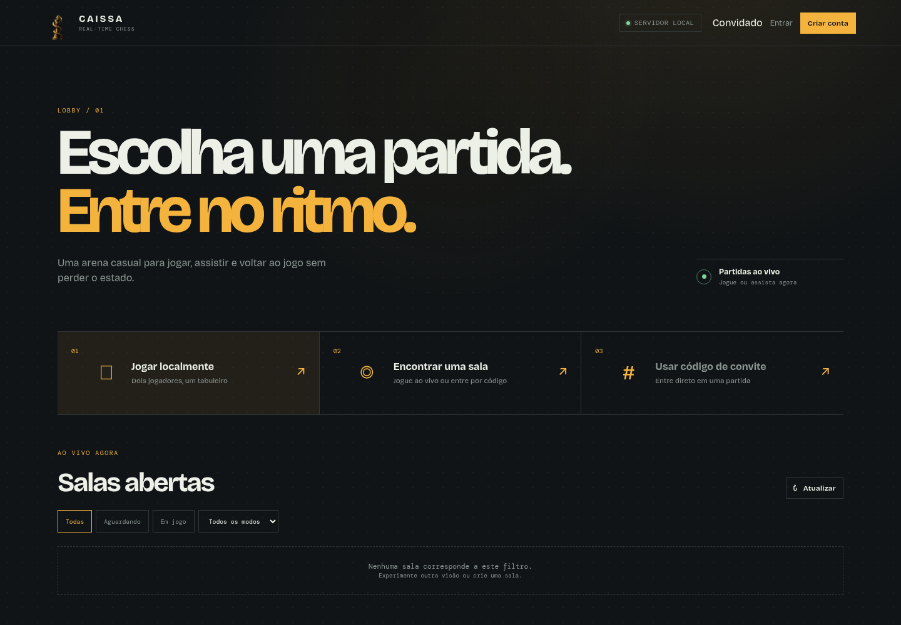
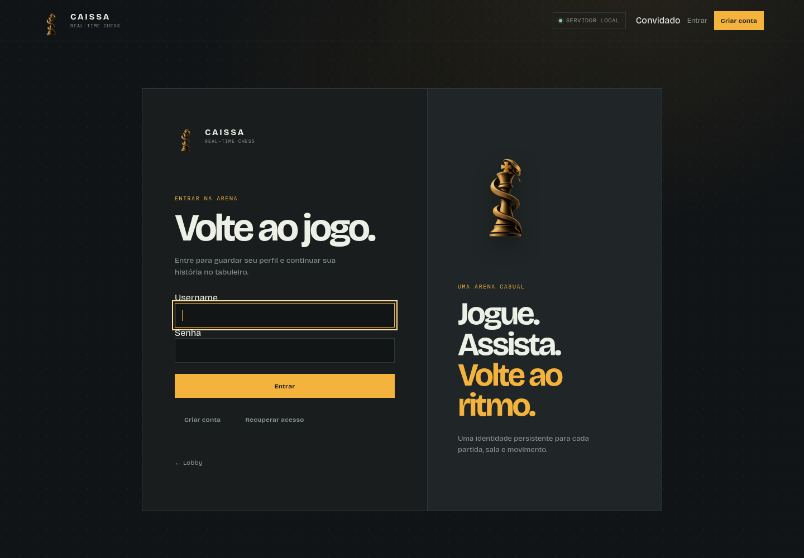

# Caissa



Caissa is a casual, real-time chess application built to be genuinely playable while demonstrating server-authoritative state, concurrent players, reconnection, spectators, persistence, and event-driven UI.

It is intentionally focused on small, friendly rooms rather than ratings, tournaments, matchmaking at scale, or competing with large chess platforms. The project is also a portfolio piece: the product experience is simple, but the underlying state transitions are explicit and testable.

[](https://github.com/SatoshoiDaemon/Caissa/actions/workflows/ci.yml)
[](LICENSE)

Official repository: [github.com/SatoshoiDaemon/Caissa](https://github.com/SatoshoiDaemon/Caissa)

## What is implemented

- Local two-player games.
- Authenticated public and code-only rooms.
- Temporary per-game player tokens for authorization.
- Anonymous read-only spectator tokens for public rooms.
- REST and Socket.IO gameplay using the same server-side rules.
- MongoDB persistence for games, rooms, accounts, sessions, and results.
- Redis coordination for locks, rate limits, presence, pub/sub, and Socket.IO scaling primitives.
- Server-authoritative clocks with `bullet`, `blitz`, `rapid`, and `classical` presets.
- Reconnection with a 60-second grace period and abandonment handling.
- Draw offers, resignation, timeout, checkmate, stalemate, and final-state persistence.
- Account profiles, recovery codes, statistics, and match history.
- Responsive Portuguese interface with keyboard support, reduced-motion behavior, and a charcoal/amber mechanical control-panel visual language.

## Screenshots

### Lobby

The lobby is the operational entry point for local play, room creation, invite-code entry, and public room discovery.


### Authentication

Authentication is a dedicated surface for login, registration, recovery, and one-time recovery-code handling.



The arena is entered from the lobby and keeps the board, players, clocks, persistent game state, move history, and spectator state in focus. Additional arena captures can be added to `docs/screenshots/` as the visual test suite grows.

## Technical decisions

### MongoDB is the durable source of truth

Game state is persisted as a complete document: FEN, active color, castling rights, en-passant target, move counters, move history, status, winner, version, players, reconnection metadata, and clock fields. MongoDB is also used for users, opaque sessions, recovery-code hashes, rooms, and account game results.

The project is designed to start from a clean local database, making the persisted state explicit from the first run.

### Redis coordinates; it does not own the game

Redis is limited to short-lived coordination: per-game locks, rate limiting, player presence, pub/sub, and Socket.IO message coordination. MongoDB remains authoritative after restarts and during concurrent transitions.

### The server owns authority

The browser never decides its color, turn, room membership, clock, or final result. REST and Socket.IO commands validate the same token, room, game, turn, status, version, and chess move constraints. A mutation is broadcast only after persistence succeeds.

### Tokens are scoped

Permanent authentication uses an opaque `HttpOnly` session cookie. A player token is scoped to one game and is stored server-side only as a hash. Spectator tokens are separate, temporary, read-only identities. Logout does not invalidate an already-started game token; the game token remains governed by the game lifecycle.

### Clocks are server-authoritative

The official modes are fixed on the server:

| Mode | Initial time | Increment |
| --- | ---: | ---: |
| Bullet | 60 seconds | 0 seconds |
| Blitz | 5 minutes | 0 seconds |
| Rapid | 10 minutes | 0 seconds |
| Classical | 30 minutes | 0 seconds |

The frontend renders `white_time_remaining_ms`, `black_time_remaining_ms`, `active_clock_color`, and related metadata received from the backend. It does not decrement the clock locally.

## Architecture

```text
Browser
  │
  ├── REST /api/v1
  └── Socket.IO events
          │
          ▼
Flask application + domain services
          │
  ┌───────┴────────┐
  ▼                ▼
MongoDB          Redis
durable state    locks, rate limits,
and history      presence, pub/sub
```

```text
src/
├── backend/
│   ├── app/             configuration and error handling
│   ├── api/routes/      REST resources and validation
│   ├── chess_logic/     board state and chess rules
│   ├── services/        state transitions and authorization
│   ├── realtime/        Socket.IO commands and events
│   ├── infrastructure/ MongoDB, Redis, rate limiting, repositories
│   └── run.py           local application entry point
└── frontend/
    ├── templates/       application shell
    └── static/          CSS, board, router, UI, realtime client
```

The frontend is a progressively enhanced single-page shell. Explicit Flask entry routes make `/`, `/home`, `/login`, `/u/<username>`, and `/room/<room_code>` refreshable without catching API, static, or unknown paths.

## API surface

### Games

```text
POST /api/v1/games
GET  /api/v1/games/{game_id}
POST /api/v1/games/{game_id}/reconnect
POST /api/v1/games/{game_id}/moves
GET  /api/v1/games/{game_id}/moves/{position}
POST /api/v1/games/{game_id}/resign
POST /api/v1/games/{game_id}/draw/offer
POST /api/v1/games/{game_id}/draw/accept
POST /api/v1/games/{game_id}/draw/decline
```

### Rooms

```text
GET  /api/v1/rooms
POST /api/v1/rooms
GET  /api/v1/rooms/{room_code}
POST /api/v1/rooms/{room_code}/join
POST /api/v1/rooms/{room_code}/spectate
```

### Accounts and profiles

```text
POST  /api/v1/auth/register
POST  /api/v1/auth/login
POST  /api/v1/auth/logout
GET   /api/v1/auth/me
POST  /api/v1/auth/password
POST  /api/v1/auth/recovery
POST  /api/v1/auth/recovery-codes
GET   /api/v1/users/{username}
GET   /api/v1/users/{username}/stats
GET   /api/v1/users/{username}/games
PATCH /api/v1/users/me/profile
GET   /api/v1/users/me/stats
GET   /api/v1/users/me/games
```

### Socket.IO events

Players use `join_room`, `make_move`, `offer_draw`, `accept_draw`, `decline_draw`, and `resign_game`. The server publishes `room_state`, `room_joined`, `player_joined`, `move_made`, `clock_updated`, `draw_offered`, `draw_declined`, `player_disconnected`, `player_reconnected`, `spectator_joined`, `game_ended`, and `server_error`.

Spectators connect with `spectate_room` and receive state updates without mutation privileges.

## Run locally

Requirements: Python 3.10+, Docker Compose, and a browser.

```bash
git clone https://github.com/SatoshoiDaemon/Caissa.git
cd Caissa
cp .env.example .env
# Replace SECRET_KEY in .env with a long random value
python -m venv .venv
source .venv/bin/activate
pip install -e '.[dev]'
docker compose up -d
PYTHONPATH=src python -m backend.run
```

Open <http://127.0.0.1:5000>.

The application runs directly with Python. Compose provides only MongoDB and Redis, each with a named local volume and healthcheck.

Useful commands:

```bash
make services       # start MongoDB and Redis
make services-down  # stop services
make run            # start Caissa
make test           # run pytest
make lint           # Ruff and Black checks
make security       # Bandit scan
make reset-db       # destructive reset with RESET_CONFIRM=CAISSA
```

## Testing strategy

The test suite is separated by responsibility:

- `tests/unit/` — chess rules, validation, tokens, clocks, and state transitions.
- `tests/api/` — REST authorization, rooms, accounts, game state, and frontend compatibility.
- `tests/realtime/` — Socket.IO authentication and event authorization.
- `tests/integration/` — real infrastructure boundaries; tests are marked `integration` where required.

Before opening a pull request, run:

```bash
make test
make lint
make security
```

## Contributing

Read [CONTRIBUTING.md](CONTRIBUTING.md) before opening an issue or pull request. Changes should preserve the server-authoritative model, use the existing naming conventions, include tests for behavior changes, and keep frontend changes compatible with the current REST and Socket.IO contracts.

Security reports should follow [SECURITY.md](SECURITY.md). This project follows the expectations in [CODE_OF_CONDUCT.md](CODE_OF_CONDUCT.md).

## License

Caissa is released under the [MIT License](LICENSE).

## Current scope

Caissa currently prioritizes casual real-time play, rooms, spectators, persistence, reconnection, clocks, profiles, and reliable state transitions. Ratings, rankings, tournaments, matchmaking, chess AI, chat, email recovery, and horizontal production deployment are intentionally outside the current scope.
